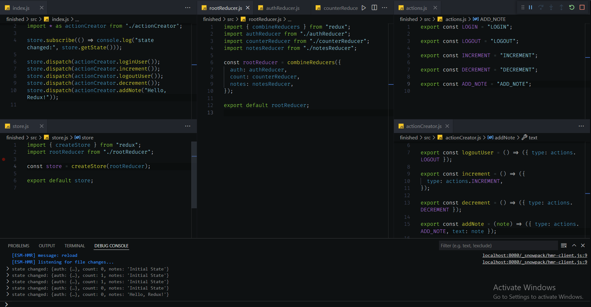

# FCC Redux

## What's Redux Basics

FCC Redux is an implementation of [FreeCodeCamp's Redux course](https://www.freecodecamp.org/learn/front-end-development-libraries/#redux) from the Frontend Libraries Certification Curriculum, on a local environment.

## Why did I create it?

I created this repository to share it with my fellow campers so they can also learn how to implement everything they learn about Redux in the browser environment in their own local environment.

## How to use it?

There are two directories:

- start
- finished

The start directory contains all the files to get the work started, and a README.md with a step by step instructions to guide you through.

The finshed directory as the name implies, contains the finshed work. It can be used to check one's work or to review my codes. 😁
